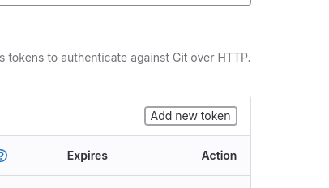
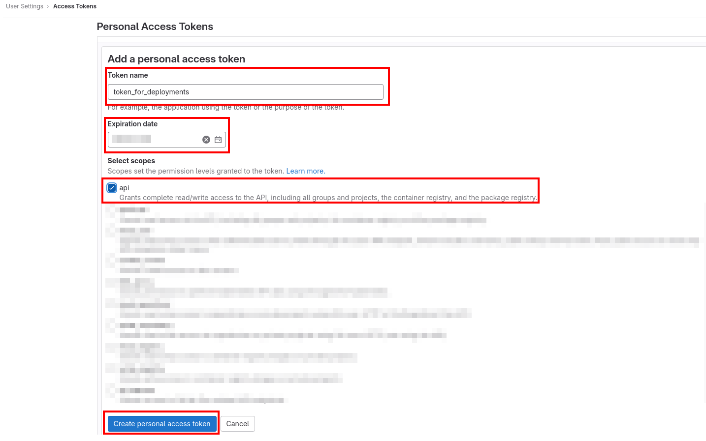
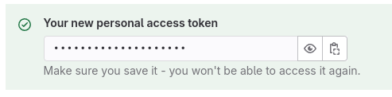
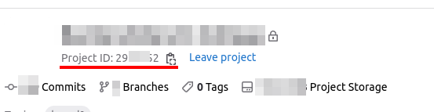

# Gitlab Deployer for Laravel


This package was created to optimize and improve a company's CI/CD in a Gitlab environment.

## Requirements

This package version requires [PHP](https://www.php.net/) 8.1 and supports [Laravel](https://laravel.com/) 9-10.

Available SSH agents on local machine and remote server.

Remote server must use GNU/Linux.

### Dependencies

This package uses GitLab API to create CI/CD variables, powered by package [`graham-campbell/gitlab`](https://github.com/GrahamCampbell/Laravel-GitLab).

For deployment uses [`deployer/deployer`](https://deployer.org/).

To render beautiful console output uses [`nunomaduro/termwind`](https://github.com/nunomaduro/termwind).

## Installation

### Add dependency

You can install this package using [Composer](https://getcomposer.org/):

```shell
composer require --dev hexide-digital/gitlab-deploy:^1.3
```

And if you are using composer version 2.4 and above,
we recommend run the [`bump`](https://php.watch/articles/composer-bump) command to lock latest version:

```shell
composer bump "hexide-digital/gitlab-deploy"
```

After installation, this package will automatically register its service provider.

## Usage

### Install and publish files

To publish files for deployment and sample files run command bellow:

```shell
php artisan deploy:install
```

Examples of files to be copied are
located in [this folder](https://github.com/hexidedigital/laravel-gitlab-deploy/tree/master/examples).

### Configurations and prepare access

Open [`.deploy/deploy-prepare.yml`](https://github.com/hexidedigital/laravel-gitlab-deploy/blob/master/examples/deploy-prepare.example.yml)
and fill all needed options.

For most cases only need to be specified next options:

- **access token** for project repository ([see tip](#gitlab-api-access-token))
- project **id** ([see tip](#project-id))
- access to the **server**
- access to the **database**

But for every stage are available next options:

- repository url
- executor paths for `php` and `composer`
- access for the server
- access to the database
- access to the mail host (but can be omitted)

### Running configuration command

#### Basic launch

You can begin configuring your project deployment for specific **stage name** (i.e. for `dev` branch) by running:

```shell
php artisan deploy:gitlab dev
```

> Normally, the stage name must be the same as git branch name.

##### After command executing

If all tasks completely executed, to enable auto-deployment go to
`Settings` -> `CI/CD` -> `Variables` and change value for `CI_ENABLED` to `1`.
After that, when you edit branch with configured deployment, Gitlab will run CI/CD Pipelines automatically.

#### Only-print launch

If you want to manually execute commands or just prepare to future deployment,
set a `--only-print` option when calling command.
All commands and examples will be written to log files located in `.deploy/logs` folder.
All that remains is to copy and execute commands from the file.

## Tips for Gitlab

### Gitlab API access token

In order for variables and other deployment options to be created, you need to grant access to the repository settings.
This package uses the **Gitlab API** method using **Access Tokens**.

We recommend creating one personal access token and use for future deployment configurations.
For this navigate to `Profile` -> `Access Tokens` and press `Add new token`.



Then fill the next options:

- **Token name** - name for you to identify token, i.e. `token_for_deployments`
- **Expiration date** - by default, automatically specified 1 month, but set longer time or remove this date
- **Scopes** - this package needs only `api` scope, but you can add more scopes

Then click `Create personal access token`.



After creating, copy this token and save in somewhere safe place, because you won't be able to access it again,
and set in deploy config file



---- 

If you don't want to use and create personal token, you can create project token with access only for repository.

To get Access Token follow this path `Settings` -> `Access Tokens` and press `Add new token`.


Fill next options like bellow:

- **Token name** - any name, `deploy_dev`, `deploy_prod` etc. 
- **Expiration date** - recommended to set 1-2 days (this will be enough)
- **Role** - select `mainterner` - this is necessary for the ability to change repository settings
- **Scopes** - select only `api`, for this package will be enough

Then click `Create project access token` to see the token, copy it and set in deploy config file.

### Project ID

Open the main page of the repository and on top you can see repository info and project id.
It also can be copied with button on the right side.



## Can I hire you guys?

Yes! Say hi: [hello@hexide-digital.com](mailto:hello@hexide-digital.com)
We will be happy to work with you! Other [work we’ve done](https://hexide-digital.com)

### Follow us

Follow us on [LinkedIn](https://www.linkedin.com/company/hexide-digital)
or [Facebook](https://www.facebook.com/hexide.digital)
